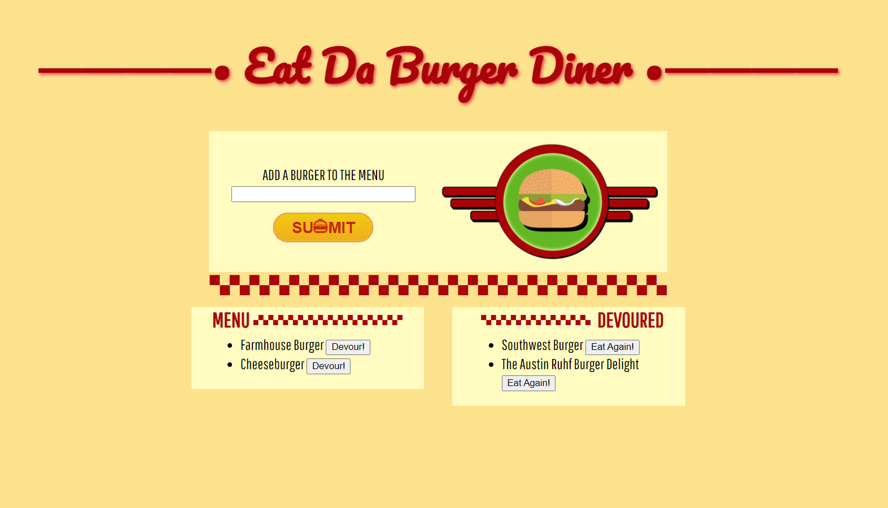

# Eat Da Burger App
  
  
  ---

  ## **Description**
    
  Eat Da Burger is a single page application that uses full-stack development where the front end communicates with a back end. On the front end, a user can interact with the page by adding a burger of their choice to the menu, and then "Devour" the burger. On the back end, a database logs the name of the new burger, whether it has been devoured or not, and gives it an id to reference internally.  

  Eat Da Burger Diner's design is inspired by menus from classic American diners. Imagine hearing dishes being thrown around a nearby kitchen, the familiar sound of a variety of conversations and laughter, and the smell of a fresh, grill-cooked burger as you interact with Eat Da Burger Diner.

  
  
  ---

  ## **Installation**
  
  The following was installed when creating this app:
  - NPM express
  - NPM express-handlebars
  - NPM mysql
  
  ---
  
  ## **Usage**
  
  Visit the deployed app here to try it out: [Deployed App](https://eatdaburger-diner.herokuapp.com/)
  
  ---
  
  